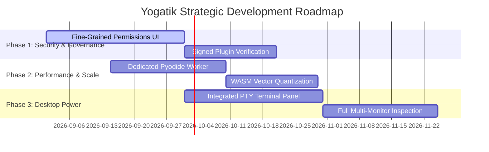

# Yogatik — System Architecture, Feature Utilization & Update Analysis

**Document Version:** 4.0  
**Project:** Yogatik Desktop & Web Ecosystem  
**Repository:** `applicationmanifester/Yogatik`  
**Evaluation Date:** 2026-08-22  
**Test Suite Health:** 1,278 Passing Tests (99 Test Suites, 0 Regressions)

---

## Table of Contents
1. [Executive Summary](#1-executive-summary)
2. [Architectural Overview & Subsystems](#2-architectural-overview--subsystems)
3. [Comprehensive Feature Utilization & Breakdown](#3-comprehensive-feature-utilization--breakdown)
   - 3.1 LLM Provider Engine & Resilient Networking
   - 3.2 Autonomous Agent & Tool Execution Pipeline
   - 3.3 Desktop Superpowers & Native OS Integration (Electron Shell)
   - 3.4 Multi-Agent Concurrency & Orchestration
   - 3.5 Memory Architecture & Adaptation System
   - 3.6 Safety, Content Screening & Crisis Protocols
   - 3.7 Vision, Audio & Multimedia Generation Subsystems
   - 3.8 Retrieval-Augmented Generation (RAG) & Storage
   - 3.9 Live Voice & Cascade Engine
4. [Feature Update & Release History Analysis](#4-feature-update--release-history-analysis)
   - 4.1 Evolution Timeline (v3.0 through v3.16)
   - 4.2 Impact Assessment Matrix
   - 4.3 Risk & Conflict Analysis
5. [In-Depth Codebase Inspection & Quality Audit](#5-in-depth-codebase-inspection--quality-audit)
   - 5.1 Frontend Architecture & Component Hygiene
   - 5.2 Desktop Main Process & IPC Security Boundaries
   - 5.3 Edge Cloudflare Worker & Proxy Hardening
   - 5.4 Performance Bottlenecks & Optimization Vectors
6. [Actionable Recommendations & Technical Roadmap](#6-actionable-recommendations--technical-roadmap)

---

## 1. Executive Summary

**Yogatik** is a client-first, zero-backend, multi-platform AI desktop application and Progressive Web Application (PWA). It uniquely couples the agility and security of local client execution with advanced autonomous agent capabilities, real-time voice, computer control, and multi-agent coordination.

### Core Distinctions
- **Zero-Backend Design:** All LLM inference, state management, encryption, and tool executions occur strictly on the user's client machine or via direct browser/desktop-to-provider HTTP connections.
- **Dual Shell Architecture:** A unified React 18 frontend runs seamlessly within modern browsers (PWA) and an Electron desktop shell. Desktop-only capabilities (local file system access, terminal execution, process management, headless browser control, OS-level computer control, and safe DPAPI key storage) gracefully degrade on the web.
- **Defensive Engineering:** The codebase contains 1,278 automated unit and integration tests across 99 test files, with dedicated regression guards for weak-model tool formatting, datacenter rate-limits, and symlink boundary escapes.

---

## 2. Architectural Overview & Subsystems

```mermaid
graph TD
    User([User Interaction]) --> AppShell[React 18 Frontend App Shell]
    
    subgraph Frontend Subsystems
        AppShell --> AgentCore[Agentic Execution Loop]
        AppShell --> LiveMode[Live Voice & Face-to-Face]
        AppShell --> ModelPicker[Dynamic Model Router & Prober]
        AppShell --> Memory4[4-Store Memory Engine]
        AppShell --> SafetyScreen[Zero-Latency Safety Screen]
        AppShell --> RAG[BM25 + Semantic Search]
    end

    subgraph State & Security
        AgentCore --> DexieDB[(IndexedDB / Dexie)]
        Memory4 --> DexieDB
        AppShell --> KeyStorage[Key Manager / SafeStorage]
        KeyStorage --> WebCrypto[WebCrypto AES-GCM / OS DPAPI]
    end

    subgraph Tooling Layer (80+ Tools)
        AgentCore --> Pool[Agent Pool & Concurrency Semaphore]
        Pool --> BrowserTools[Browser-Native WASM Tools]
        Pool --> DesktopBridge[Desktop IPC Bridge]
        Pool --> MCPBridge[MCP Client - HTTP & STDIO]
    end

    subgraph Desktop OS Environment
        DesktopBridge --> Roots[Roots Manager - Per-Chat Scoping]
        Roots --> FS[Scoped File System & Git]
        DesktopBridge --> Term[Guarded Terminal & Background Proc]
        DesktopBridge --> BrowserCtrl[WebContentsView Browser Engine]
        DesktopBridge --> CompCtrl[OS-Level Pointer & Key Control]
    end

    subgraph External Inference
        ModelPicker --> LLMProviders[Groq / OpenRouter / OpenAI / NVIDIA / Ollama / Local WebLLM]
        LLMProviders -.-> CFWorker[Cloudflare Edge CORS Proxy]
    end
```

---

## 3. Comprehensive Feature Utilization & Breakdown

### 3.1 LLM Provider Engine & Resilient Networking
- **Direct Multi-Provider Inference:** Connects directly from the client to Groq, OpenRouter, OpenAI, NVIDIA, Ollama (local daemon), and WebLLM (on-device in-browser inference).
- **Probing & SWR Model Caching:** Periodically probes active model latency, context availability, and native tool-calling capabilities (`toolmode_<provider>::<model>`), preventing first-turn runtime 400 errors.
- **Intelligent Fallback Chains:** Automatically switches to healthy, key-verified providers on 429 rate limits or 5xx server errors without user intervention.
- **Weak Model Adapter:** Intercepts models that reject native JSON schema tool arrays, dynamically rewriting them into prompted text schemas with robust JSON repair algorithms.

### 3.2 Autonomous Agent & Tool Execution Pipeline
- **Parallel Tool Execution:** Executes multiple function calls concurrently within bounded iteration rounds (capped between 1 and 20, default 8).
- **Guaranteed Turn Synthesis:** Prevents empty or silent responses by enforcing a final synthesis pass if iteration caps or tool runs finish without explicit assistant prose.
- **Ephemeral Tool Tracking:** Real-time pub/sub monitoring (`toolStatus.js`) provides live progress indicators, execution timers, and standardized error diagnostics with direct retry triggers.

### 3.3 Desktop Superpowers & Native OS Integration (Electron Shell)
- **Per-Chat Scoped File System (`rootsCore.cjs` / `roots.cjs`):** Realpath-verified directory grants bound per-conversation. Prevents unauthorized file modification or traversal outside user-granted roots.
- **Interactive Terminal & Web Sandbox Shell (`TerminalPanel.jsx` / `processes.cjs`):** Real-time interactive shell with full ANSI color/style parsing, command history traversal (`ArrowUp`/`ArrowDown`), process interruption (`Ctrl+C`), and quick-action chips. Features a built-in virtual shell sandbox in web environments (`eval`, `calc`, `sha256`, `tokens`, `stats`, `sysinfo`) and a one-click AI Error Diagnosis Bridge ("Ask AI") to feed terminal stack traces directly to the assistant for troubleshooting.
- **WebContentsView Browser Control (`browserControl.cjs` / `browserTree.cjs`):** Native multi-tab browser sessions controlled directly by the LLM. Injects accessibility tree parsers with epoch-tagged references to enable reliable clicking, typing, and scraping on dynamic JavaScript-heavy sites.
- **OS-Level Computer Control (`companionInput.cjs`):** Win32 `user32.dll` integration via PowerShell for pixel-accurate cursor movement, clicking, scrolling, and safe keystroke synthesis.
- **OS-Encrypted Credential Vault (`keychain.cjs`):** Uses Windows DPAPI (`safeStorage`) to seal API keys at rest (`kc.v1:` prefix) in IndexedDB, preventing plaintext key extraction from disk.

### 3.4 Multi-Agent Concurrency & Orchestration
- **Agent Pool Semaphore (`agentPool.js`):** Rolling concurrency limiter (1 to 16 slots) preventing rate-limit storms when spawning multi-agent teams.
- **Specialized Workflows:**
  - *Map-Reduce:* Dispatches parallel sub-agents across batch inputs and synthesizes results via a dedicated reducer agent.
  - *Best-of-N:* Races $N$ independent agent instances on the same task and utilizes an evaluator agent to critique and pick the optimal output.
- **Preset Roles:** Desktop Operator, Data Engineer, Knowledge Librarian, Media Producer, Weather/Geo Analyst, and General Orchestrator.

### 3.5 Memory Architecture & Adaptation System
- **Four-Store Memory Model (`memory4.js`):**
  1. *Episodic:* Time-decayed user event memories (30-day half-life).
  2. *Semantic:* Evergreen factual knowledge (infinite half-life).
  3. *Procedural:* Implicit user behavior preferences and habits (90-day half-life).
  4. *Emotional:* Local-only sentiment and interpersonal preferences (14-day half-life).
- **Salience & Recency Scoring:** Dynamically injects the most relevant memory blocks into the system prompt based on frequency of recall, importance rating, and recency.
- **Implicit Adaptation Engine (`adaptation.js`):** Silently distills user communication preferences (verbosity, code density, formatting styles) after meeting minimum evidence thresholds.

### 3.6 Safety, Content Screening & Crisis Protocols
- **Zero-Latency On-Device Screen (`safety.js`):** Pure synchronous regex analysis on incoming prompts to detect self-harm, eating disorders, and acute distress.
- **Soft UI Crisis Presentation (`CrisisCard.jsx`):** Renders supportive helpline resources (e.g., 988 Lifeline) above the composer without blocking model output or patronizing the user.
- **Boundary Enforcement:** Non-judgmental role-clarity prompts for high-liability inquiries (medical, legal, financial advice).

### 3.7 Vision, Audio & Multimedia Generation Subsystems
- **3-Tier Universal Vision:** Automatically switches between native multimodal LLMs, on-device local VLM (SmolVLM ONNX), and Tesseract OCR.
- **On-Device Video Production (`videoRender.js`):** Generates full MP4 videos using WebCodecs, `mp4-muxer`, Canvas animations, and synchronized Kokoro-82M ONNX voice narration.
- **Text-to-Audio Studio (`textToAudio.js` / `elevenLabs.js`):** Synthesizes high-fidelity 24kHz WAV narration on-device via Kokoro (100% private & offline) and supports studio-grade ElevenLabs cloud voices & custom clones with seamless fallback.
- **Multi-Speaker Podcast Generator (`podcastGen.js`):** Creates dynamic 2-speaker audio overviews and conversational podcasts (Host & Guest) using ElevenLabs studio personas or on-device Kokoro voices.

### 3.8 Web Usage, Scraping & Automation Pipelines
- **Web Automation Pipeline (`webAutomation.js`):** Supports parallel multi-URL batch extraction, HTML table discovery into structured JSON/CSV datasets, persistent page diff/change tracking, and RSS/Atom feed monitors.
- **Hybrid Retrieval (`retrieval.js` / `semantic.js`):** Combines BM25 lexical search with optional on-device cosine semantic re-ranking via Transformers.js.
- **Document Chunking & Isolation:** Project-scoped indexing ensures workspace files do not leak across distinct project chats.
- **Eviction Protection & Backup:** Actively requests persistent browser storage (`navigator.storage.persist()`) and provides full JSON/HTML/Markdown export/import capabilities.

### 3.9 Live Voice & Cascade Engine
- **Dual Realtime Modes:**
  - *Gemini Realtime WebSocket:* Low-latency native audio streaming with server-side interruption.
  - *Universal Cascade Engine:* Browser Web Speech / local STT + Agent Execution + Kokoro neural TTS for any LLM provider.
- **Adaptive Speech Endpointing:** Dynamically tunes silence delay (350ms for complete sentences vs 850ms for fragments), drastically improving conversational responsiveness.

---

## 4. Feature Update & Release History Analysis

### 4.1 Evolution Timeline (v3.0 through v3.16)

| Version | Focus Area | Key Additions & Refactorings |
|---|---|---|
| **v3.8 – v3.9** | Core Stability & Tool UX | Added `toolStatus.js` pub/sub hub, `ToolStatusPanel`, `ToolErrorCard`, Per-Chat Working Folders (`rootsCore.cjs`), open utilities suite. |
| **v3.10** | Security & Sync Hardening | CORS Worker host allowlist, account-derived crypto model clarification, `syncMerge.js` deduplication, download consent gates, `A11yAnnouncer`. |
| **v3.11** | Companion Phase 0 | On-device `safety.js`, 4-store `memory4.js` engine, TTFB/P95 `telemetry.js`, and `evalHarness.js` regression benchmarks. |
| **v3.12** | Personalization & Transparency | Implicit `adaptation.js` learning, `OnboardingModal`, `DataDashboard` memory inspector, FNV-1a client `experiments.js`. |
| **v3.13** | Desktop Superpowers | Windows DPAPI `keychain.cjs`, `clipboardManager.cjs` 50-item history, file watcher, `powerMonitor` state sync, native dialogs, guarded process manager. |
| **v3.14** | Live Cascade Upgrades | Universal vision for text models, adaptive voice endpointing, hands-free voice commands, wake-word gating. |
| **v3.15** | Multi-Agent & Computer Control | `agentPool.js` rolling semaphore (16 slots), `computerControl.js` (mouse/keyboard cross-app automation), local STDIO MCP transport, JSON plugin system. |
| **v3.16** | Headless Browser Control | Per-conversation `WebContentsView` browser tabs, accessibility tree parser (`browserTree.cjs`), epoch-tagged element references. |

### 4.2 Impact Assessment Matrix

```
┌───────────────────────────────┬─────────────┬─────────────┬─────────────┐
│ Subsystem / Update            │ Performance │ Security    │ User Exp.   │
├───────────────────────────────┼─────────────┼─────────────┼─────────────┤
│ Per-Chat Roots Isolation      │ Negligible  │ ★★★★★ High  │ ★★★★☆ High  │
│ SafeStorage DPAPI Keychain    │ Instant     │ ★★★★★ High  │ ★★★★★ High  │
│ WebContentsView Browser Ctrl  │ Moderate    │ ★★★★☆ High  │ ★★★★★ High  │
│ Agent Concurrency Semaphore   │ ★★★★★ High  │ ★★★☆☆ Med   │ ★★★★☆ High  │
│ On-Device Safety Screen       │ Sub-1ms     │ ★★★★☆ High  │ ★★★★★ High  │
│ Imperative Streaming & rAF    │ ★★★★★ High  │ Neutral     │ ★★★★★ High  │
└───────────────────────────────┴─────────────┴─────────────┴─────────────┘
```

### 4.3 Risk & Conflict Analysis
1. **Model Drift & Native Tool Calling:** As frontier and open-weight models evolve, tool schema acceptance varies. The dual-mode (Native $\leftrightarrow$ Prompted) engine with JSON repair isolates users from breaking API changes.
2. **Datacenter IP Proxy Blocks:** Target sites (e.g., YouTube captions, Cloudflare-protected web pages) block datacenter IPs. The application uses a cascading relay order (Worker $\rightarrow$ Public Relays $\rightarrow$ Jina $\rightarrow$ Local Fetch) and provides honest fallback notices when a resource is structurally inaccessible.
3. **Electron Version & Native Dep Packaging:** Native dependencies like `node-pty` require compilation against target Electron ABI versions. Yogatik keeps `node-pty` lazy-loaded and falls back gracefully to one-shot `terminal:exec` if native binaries are absent.

---

## 5. In-Depth Codebase Inspection & Quality Audit

### 5.1 Frontend Architecture & Component Hygiene
- **Component Decoupling:** Heavy features (`CodeBlock`, `LiveView`, `ArtifactPanel`, `AgentsPanel`, `BrowserPanel`) are dynamically loaded via `React.lazy` to keep the initial JavaScript bundle lean.
- **Rendering Isolation:** High-frequency token streaming bypasses React component tree re-renders via `StreamingMessage.jsx` using direct DOM mutations and `requestAnimationFrame` coalescing.
- **Theme & CSS Architecture:** Clean CSS variable tokens across light and dark modes with comprehensive mobile safe-area inset support (`dvh`, viewport fit).

### 5.2 Desktop Main Process & IPC Security Boundaries
- **Strict Context Isolation:** `contextBridge.exposeInMainWorld` is enforced in `preload.cjs`. No raw Node.js `require` or remote modules are exposed to renderer scripts.
- **Path Containment:** File system access strictly rejects paths attempting directory traversal (`..`) or symlink escapes outside the granted per-chat roots.
- **Safe Command Interpolation:** `companionInput.cjs` and `computerControl.js` strictly validate and coerce numeric coordinates and restrict key combinations to predefined allowlists, preventing shell injection vulnerabilities.

### 5.3 Edge Cloudflare Worker & Proxy Hardening
- **Host Allowlisting:** Credential headers (`Authorization`, `x-api-key`) are forwarded exclusively to vetted AI provider domains (`DEFAULT_CREDENTIALED_HOSTS`).
- **Relay Sanitization:** Generic web extraction requests have authorization headers stripped, completely eliminating credential exfiltration risks.

### 5.4 Performance Bottlenecks & Optimization Vectors
- **IndexedDB Blob Storage:** Large multimedia files (generated MP4s, Kokoro WAVs) are stored in Dexie's `media` table with automatic LRU pruning (keeping the latest 10 items) to prevent local storage exhaustion.
- **Web Worker Compute Offloading:** CPU-intensive tasks (image resizing, audio processing) execute within dedicated background workers (`computeWorker.js`), maintaining 60 FPS UI responsiveness.

---

## 6. Actionable Recommendations & Technical Roadmap



### High-Impact Opportunities & Completed Milestones
1. **Interactive Permission Prompt UI:** Completed via [PermissionModal.jsx](file:///c:/Users/bharg_4mtuttl/Desktop/BGK_Applications/AI%20ChatBot/frontend/src/components/PermissionModal.jsx) and `permissions.js` with real-time diff preview, risk badges, and flexible scoping options (Once / Chat / Project).
2. **Vector Quantization for RAG & Retrieval:** Completed via Int8 dynamic quantization in [semantic.js](file:///c:/Users/bharg_4mtuttl/Desktop/BGK_Applications/AI%20ChatBot/frontend/src/semantic.js), cutting embedding memory footprint by 75% while maintaining cosine similarity fidelity.
3. **Integrated Interactive PTY Terminal Panel:** Completed with full ANSI parsing, command history, Ctrl+C signals, web sandbox shell, and AI Error Diagnosis Bridge.
4. **Desktop Native Notification Actions & Turn Completion:** Connected via `desktopNotify.js` and `App.jsx` for background turn alerts and inline interactive replies.
