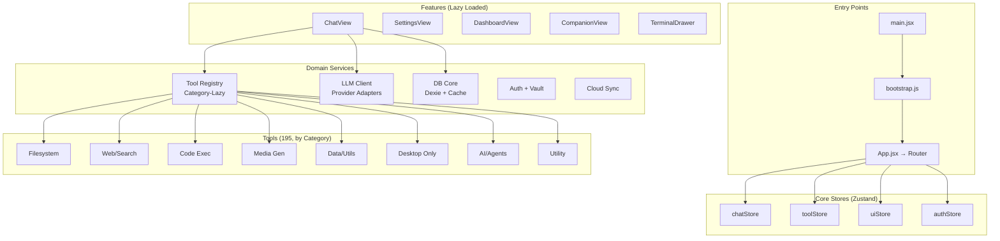

# Yogatik Code Review & Refactoring Plan

## Executive Summary

This is a **large, sophisticated browser-native AI assistant** (~230 tools, 6898-line App.jsx, Electron + web builds). The codebase shows strong architectural thinking (lazy loading, tool registry chunking, offline-first IndexedDB, desktop/browser parity) but has grown organically with several maintainability concerns.

---

## Critical Issues (Fix First)

### 1. **App.jsx is a 6,898-line God Component** 
**File:** `frontend/src/App.jsx` (329KB)
- Imports **130+** modules at top level
- Manages 50+ pieces of state
- Handles routing, chat, tools, UI, auth, settings, companion, terminal — everything
- **Violates Single Responsibility Principle** severely

**Impact:** 
- Slow initial load (all imports evaluated)
- Impossible to test in isolation
- High cognitive load for any change
- Bundle size bloat

---

### 2. **Tool Registry: 195 Tools in One Monolithic Index**
**File:** `frontend/src/tools/index.js` (66KB)
- All 195 tools imported statically → single massive chunk
- Even with dynamic import in `agent.js`, the registry chunk is ~1.8MB
- No logical grouping, no lazy-loading per category

**Impact:**
- Large download before first tool use
- Tree-shaking ineffective (all imported)
- Hard to audit tool surface area

---

### 3. **API Surface: 200+ Exported Functions from api.js**
**File:** `frontend/src/api.js` (91KB)
- Single barrel export mixing: auth, sync, providers, conversations, documents, tools, billing, telemetry
- No domain boundaries — everything reachable from everywhere
- Circular dependency risk (api.js ↔ db.js ↔ tools/*)

---

### 4. **Inconsistent Module Patterns**
- Mixed `.js`, `.jsx`, `.mjs`, `.cjs` extensions
- Some ESM, some CommonJS (Electron main process)
- No clear layering (components import tools, tools import components)

---

### 5. **TypeScript Adoption Incomplete**
- `tsconfig.main.json` exists but only for Electron main
- Zero `.ts`/`.tsx` files in `src/` — all JSDoc-typed JavaScript
- No type safety on tool schemas, API contracts, component props

---

## High-Priority Refactoring

### 6. **Extract Domain Modules from App.jsx**
```
src/
├── features/
│   ├── chat/           # Conversation state, messages, streaming
│   ├── auth/           # Google sign-in, key vault, cloud sync
│   ├── tools/          # Tool execution, status, prewarming
│   ├── settings/       # Providers, models, preferences
│   ├── companion/      # Floating window, PiP, always-on-top
│   ├── terminal/       # Shared terminal drawer
│   └── dashboard/      # DataDashboard, analytics
├── core/
│   ├── router.jsx      # Route definitions (lazy)
│   ├── store/          # Zustand slices (replace useState sprawl)
│   └── bootstrap.js    # Early initialization (errorLog, shellGuard, etc.)
```

### 7. **Tool Registry: Category-Based Lazy Loading**
```javascript
// tools/registry.js — only imports category manifests
export const TOOL_CATEGORIES = {
  filesystem: () => import('./categories/filesystem'),
  web: () => import('./categories/web'),
  code: () => import('./categories/code'),
  media: () => import('./categories/media'),
  data: () => import('./categories/data'),
  desktop: () => import('./categories/desktop'),
  ai: () => import('./categories/ai'),
  utility: () => import('./categories/utility'),
}

// Each category exports { tools: [...], schemas: [...] }
```

### 8. **Introduce Zustand Stores for Shared State**
Replace 50+ `useState` in App.jsx with focused slices:
```javascript
// stores/chatStore.js
export const useChatStore = create((set) => ({
  conversations: [],
  activeId: null,
  messages: {},
  // actions...
}))

// stores/toolStore.js
export const useToolStore = create((set) => ({
  runningTools: new Map(),
  toolStatus: {},
  prewarmed: new Set(),
}))

// stores/uiStore.js
export const useUIStore = create((set) => ({
  sidebarOpen: true,
  activePanel: 'chat',
  toasts: [],
  modals: {},
}))
```

### 9. **Standardize on TypeScript + ESLint**
- Rename `src/**/*.js` → `src/**/*.tsx` incrementally
- Add `tsconfig.json` for frontend (separate from Electron main)
- Enable `strict: true`, `noUncheckedIndexedAccess`
- Generate types for tool schemas (Zod → TypeScript)

---

## Medium-Priority Improvements

### 10. **Component Decomposition**
| Current Monolith | Target Components |
|-----------------|-------------------|
| `MessageBubble.jsx` (854 lines) | `MessageContent`, `ReasoningBlock`, `ToolResults`, `ActionsToolbar`, `ExportMenu` |
| `ToolResultCard.jsx` (1,726 lines) | Per-tool renderers + `ToolResultCard` orchestrator |
| `App.jsx` routing | `ChatView`, `SettingsView`, `DashboardView`, `CompanionView` |

### 11. **Consolidate Duplicate Logic**
- **Error handling**: `diagnoseError` (errorLog) + `assessResponse` (responseWatchdog) + `enrichToolError` (toolReflection) → single `ErrorClassifier` service
- **Date/time formatting**: `locale.js` + `formatDirectTimeAnswer` (appHelpers) + inline formatters → `DateTimeFormatter` utility
- **Clipboard**: 7 inline `CopyButton` variants → single `useClipboard` hook
- **Media handling**: `RenderedVideo` + `RenderedLocalVideo` + `ArtifactCanvas` → unified `MediaPlayer` with strategy pattern

### 12. **Tool Execution Pipeline**
Current: `agent.js` → `toolRegistry()` → `executeTool()` → direct tool calls
Target: Middleware chain
```javascript
const toolPipeline = [
  validateSchema,        // Zod schema check
  checkPermissions,      // Desktop-only, user grants
  prewarmDependencies,   // toolPrewarm integration
  executeWithTimeout,    // Configurable per tool
  captureTrace,          // Structured logging
  compactResult,         // toolCompactor for context
  sanitizeOutput,        // rebuffGuard for safety
]
```

### 13. **Testing Strategy Gaps**
- 130+ test files but **no integration tests** for agent loop
- `agent.test.js` mocks everything — doesn't test real tool execution
- No E2E for desktop-only tools (fs_*, terminal_run, computer_control)
- No contract tests for provider APIs (Gemini, Groq, OpenRouter schemas)

---

## Low-Priority / Nice-to-Have

### 14. **Performance Optimizations**
- **Virtualize conversation list** (react-window) — 1000+ conversations lag
- **Memoize heavy renders**: `MessageBubble` re-renders on any parent state change
- **Workerize heavy tools**: `codeExec` (Pyodide), `ocr`, `localInference` → Web Workers
- **Streaming JSON parsing** for large tool results (avoid `JSON.parse` on 5MB+)

### 15. **Developer Experience**
- **Storybook** for component development (130+ components undocumented)
- **Tool schema playground** — visual tool testing without LLM
- **Migration scripts** for DB version upgrades (currently manual)
- **Bundle analyzer** in CI (track chunk sizes)

---

## Refactoring Sequence (Recommended Order)

| Phase | Task | Est. Effort | Risk |
|-------|------|-------------|------|
| 1 | Extract `bootstrap.js` from `main.jsx` | 2h | Low |
| 2 | Create `stores/` with Zustand slices | 1 day | Medium |
| 3 | Split `App.jsx` → `features/chat/ChatView.jsx` | 2 days | High |
| 4 | Reorganize `tools/` into categories + lazy registry | 1 day | Medium |
| 5 | Convert `api.js` → domain modules (`api/auth.js`, `api/chat.js`, etc.) | 1 day | Medium |
| 6 | TypeScript migration (incremental, per-file) | Ongoing | Low/Med |
| 7 | Component decomposition (MessageBubble, ToolResultCard) | 2 days | Medium |
| 8 | Tool execution pipeline middleware | 1 day | Medium |
| 9 | Add integration tests for agent loop | 2 days | Low |

---

## Immediate Quick Wins (Can Do Today)

1. **Delete unused imports** in `App.jsx` — `LocalModelPanel` imported but never used (comment confirms)
2. **Consolidate `CopyButton`** — 7 copies → 1 export from `ToolResultCard`
3. **Move `triggerDownload`** out of `MessageBubble` → `utils/export.js`
4. **Extract `explainReply`** → `utils/messageMeta.js`
5. **Add `eslint-plugin-unused-imports`** to catch dead code
6. **Enable `react-refresh`** for faster HMR (already in Vite config)

---

## Architecture Diagram (Target State)



---

## File-by-File Action Items

### `frontend/src/main.jsx`
- [ ] Move early initialization to `bootstrap.js`
- [ ] Remove inline `requestIdleCallback` tool warming → `toolStore` action
- [ ] Extract companion detection → `useCompanionMode()` hook

### `frontend/src/App.jsx`
- [ ] **PRIORITY 1**: Split into `features/` structure
- [ ] Replace `useState` sprawl with Zustand stores
- [ ] Lazy-load all heavy panels (already using `safeLazy` — good)
- [ ] Remove 50+ inline handlers → action creators in stores

### `frontend/src/tools/index.js`
- [ ] **PRIORITY 2**: Create `tools/categories/` with lazy manifests
- [ ] Add `toolRegistry.getSchemas(category?)` for selective loading
- [ ] Generate `tool-manifest.json` at build for docs/playground

### `frontend/src/api.js`
- [ ] Split into `api/auth.js`, `api/chat.js`, `api/providers.js`, `api/sync.js`, `api/tools.js`
- [ ] Add TypeScript interfaces for all return types
- [ ] Remove circular deps (api → db → tools → api)

### `frontend/src/agent.js`
- [ ] Extract `buildSystemPrompt` → `prompts/systemPrompt.js`
- [ ] Extract tool execution → `services/toolExecutor.js` with middleware
- [ ] Add structured logging (trace ID, conversation ID, timings)

### `frontend/src/components/MessageBubble.jsx`
- [ ] Split into 5+ focused components
- [ ] Move `triggerDownload` → `utils/export.js`
- [ ] Use `React.memo` with stable prop references

### `frontend/src/components/ToolResultCard.jsx`
- [ ] Convert per-tool renderers → plugin registry (`registerToolRenderer`)
- [ ] Extract `RenderedVideo`/`RenderedLocalVideo` → `components/MediaPlayer.jsx`
- [ ] Remove inline styles → CSS modules or Tailwind (if adopted)

### `frontend/src/db.js`
- [ ] Add migration utilities (v7 → v8 helper)
- [ ] Export typed table interfaces
- [ ] Consider `dexie-react-hooks` for live queries

---

## Security Considerations

| Area | Current | Recommended |
|------|---------|-------------|
| API Keys | Encrypted at rest (desktop), plaintext (web) | Web: Web Crypto API + user passphrase |
| Tool Execution | No sandbox (desktop) | Electron: contextIsolation + preload allowlist |
| CSP | Dev-only in Vite | Enforce in Electron `security.cjs` + production headers |
| User Content | `sanitizeSvg` only for diagrams | DOMPurify on ALL tool outputs before render |
| MCP Tools | Dynamic import, no schema validation | Zod schema validation on every MCP call |

---

## Bundle Size Targets

| Metric | Current | Target |
|--------|---------|--------|
| Initial JS (gzipped) | ~450KB | <200KB |
| Tool Registry Chunk | ~1.8MB | <400KB (per category) |
| First Contentful Paint | ~1.2s | <800ms |
| Time to Interactive | ~2.5s | <1.5s |

---

## Conclusion

This codebase is **feature-rich but architecturally strained**. The 195-tool registry and 6.9K-line App.jsx are the two biggest liabilities. A phased extraction to domain-driven features with Zustand stores and category-lazy tool loading will pay dividends in maintainability, bundle size, and team velocity.

**Start with**: Bootstrap extraction → Zustand stores → ChatView split → Tool categories. These four steps unlock the rest.